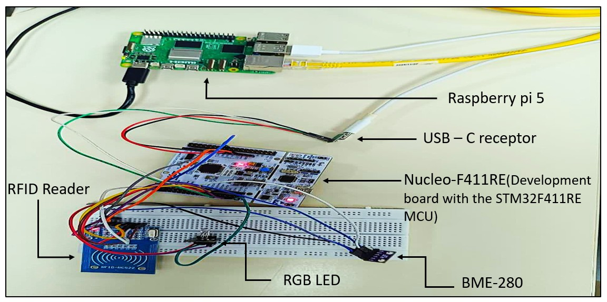
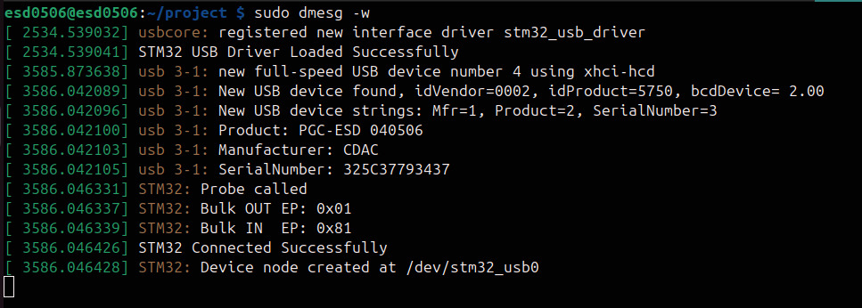
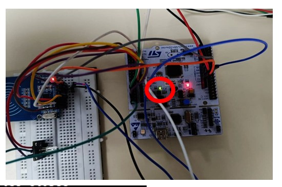
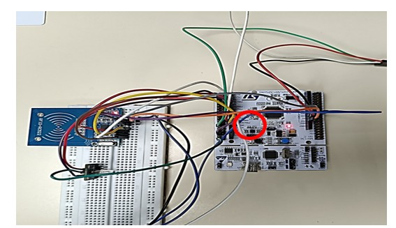
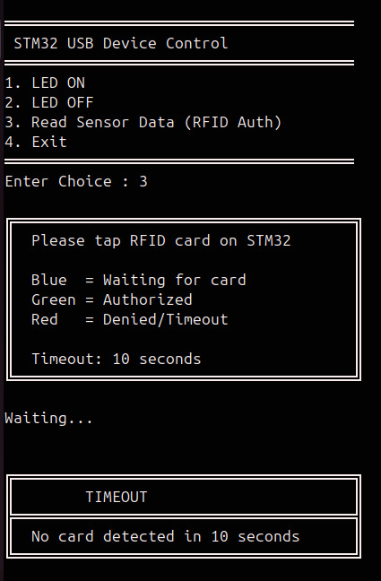

# Design And Development of a Custom Linux USB Character Driver for STM32F411RE

A custom **Linux USB character driver** developed on **Raspberry Pi 5** to communicate with an **STM32F411RE** through a **Vendor-Specific USB interface**.

The project demonstrates the complete communication path from a Linux user-space application to an STM32 USB device using the Linux USB subsystem, USB Bulk transfers, and a custom character-device interface.

---

## 📌 Project Overview

The system consists of:

* **Raspberry Pi 5** – Linux USB Host
* **STM32F411RE** – USB Device
* **Custom Linux USB Character Driver**
* **Vendor-Specific USB Interface**
* **MFRC522** – RFID Reader
* **BME280** – Sensor
* **LED** – Status indication

The Linux driver exposes the STM32 USB device to user space through:

```text
/dev/stm32_usb0
```

The user-space application communicates with the driver using standard file operations:

```text
open()
read()
write()
release()
```

---

## 🎯 Project Objective

The main objective is to develop and understand a **custom Linux USB character driver** for communication with an STM32F411RE.

The project focuses on:

* Linux USB driver development
* USB device enumeration
* USB descriptors and endpoints
* USB Bulk IN/OUT communication
* Character-device interface
* Kernel-to-user-space data transfer
* STM32 Vendor-Specific USB firmware
* RFID-based authentication
* Sensor interfacing

---

## 🔄 Project Flow

When the STM32F411RE is connected to the Raspberry Pi 5, Linux performs USB enumeration and reads the USB descriptors. The custom USB driver matches the configured VID and PID and the `probe()` function is invoked. During probing, the driver identifies the Bulk IN and Bulk OUT endpoints from the USB interface descriptor, registers the device, and creates the character device node `/dev/stm32_usb0`. The user-space application then communicates with the STM32 through the character device. LED commands are transferred through the USB Bulk OUT endpoint and acknowledgments are received through the Bulk IN endpoint. For the sensor operation, the STM32 waits for an RFID card for up to 10 seconds. If an authorized RFID card is detected, the operation proceeds to the sensor-reading stage; otherwise, access is denied or a timeout response is generated.

---

# 🔌 USB Communication

The communication between Raspberry Pi and STM32 uses **USB Bulk transfers**.

### Host → Device

Commands from the user application travel through:

```text
User Application
       ↓
/dev/stm32_usb0
       ↓
Linux USB Driver
       ↓
USB Bulk OUT
       ↓
STM32F411RE
```

### Device → Host

Responses from the STM32 travel through:

```text
STM32F411RE
       ↓
USB Bulk IN
       ↓
Linux USB Driver
       ↓
/dev/stm32_usb0
       ↓
User Application
```


# 🔩 Hardware

| Component      | Function          |
| -------------- | ----------------- |
| Raspberry Pi 5 | Linux USB Host    |
| STM32F411RE    | USB Device        |
| MFRC522        | RFID Reader       |
| BME280         | Sensor            |
| LED            | Status indication |

### Interfaces Used

| Interface | Device               |
| --------- | -------------------- |
| USB       | Raspberry Pi ↔ STM32 |
| SPI       | STM32 ↔ MFRC522      |
| I²C       | STM32 ↔ BME280       |

---

# 🧪 Results

The implemented system was tested for USB enumeration, LED control, RFID authentication, timeout handling, and USB disconnection.

## 1. Project Prototype



---

## 2. USB Enumeration

The STM32 USB device is successfully detected by the Raspberry Pi and the custom driver is loaded.



---

## 3. LED ON

The LED ON command is sent from the user application to the STM32 through the Linux USB driver.



---

## 4. LED OFF

The LED OFF command is successfully sent to the STM32 through the USB driver.



---

## 5. RFID Access Granted

A valid RFID card is detected and access is granted.


---

## 6. RFID Access Denied

An unauthorized RFID card is detected and access is denied.


---

## 7. RFID Timeout

When no RFID card is detected within the specified 10-second period, the system generates a timeout response.



---

## 8. USB Disconnection

USB disconnection is detected by Linux and the driver's disconnect handling is triggered.


---

# 📚 Key Concepts Demonstrated

* Linux USB driver architecture
* USB enumeration
* USB descriptors
* USB device identification
* USB interfaces
* USB endpoints
* USB Bulk transfers
* Linux USB Core APIs
* Character devices
* `probe()` and `disconnect()`
* `file_operations`
* Kernel memory allocation
* User/kernel-space data transfer
* Mutex synchronization
* Kernel reference counting
* STM32 USB device firmware
* SPI communication
* I²C communication
* RFID authentication

---

# 🚀 Future Scope

* Support for multiple STM32 USB devices
* Asynchronous USB transfers
* Improved command/response protocol
* Improved error handling
* Additional hardware control commands
* Hardware-specific `ioctl()` interfaces
* Integration with appropriate Linux subsystems

---

# ⭐ Project Highlights

```text
Custom USB Device
       +
Linux Kernel USB Driver
       +
Character Device Interface
       +
USB Bulk Communication
       +
STM32 Firmware
       +
RFID Authentication
       +
Embedded Peripherals
```

The project demonstrates the integration of **Linux kernel development and embedded USB firmware** in a single system.

---

